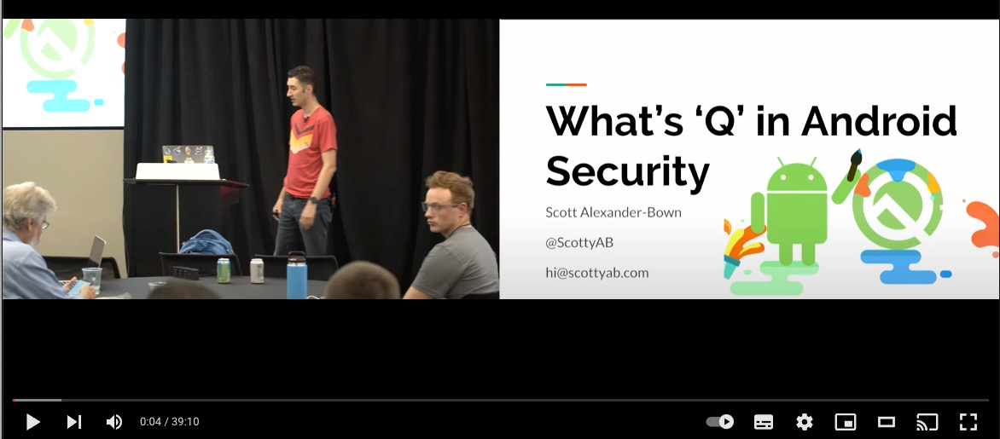

# Speaker Timeline

Here's a brief summary my various speaking engagements. 

I enjoy speaking about Android and mobile app security. If you’d like me to come speak at your conference or meetup please feel free to contact me.

[Speakerdeck profile](https://speakerdeck.com/scottyab) that contains the slide decks from many of these talks.

## 2020 / 2021 / 2022
* Covid 19 and sabbatical from speaking 

## 2019
* GDG Devfest Bristol – What’s ‘Q’ in Android Security – [link](https://devfest2019.gdgbristol.org/sessions/-LriunsnHZEu0GryxYXc),  [slides](https://speakerdeck.com/scottyab/whats-q-in-android-security)
* GDG Devfest Bristol –  Faster mobile debugging using a HTTP Proxy – [link](https://devfest2019.gdgbristol.org/sessions/-LrhszuSKOW5Jnw5XAkA)
* Mobiconf Krakow, Poland – What’s ‘Q’ in Android Security – [link](https://2019.mobiconf.org/speaker/scott-alexander-bown/)
* Android Summit, Washington, USA – What’s ‘Q’ in Android Security – [link](https://www.androidsummit.org/), [video](https://www.youtube.com/watch?v=o7FisKhsLRM)
* SWmobile, Bristol – Web Proxy Debugging with Charles Proxy – [video](https://www.youtube.com/watch?v=Pr8rp1YNeJU)

## 2018
* Droidcon, London – What’s new in Android P Security – [video](https://skillsmatter.com/skillscasts/12452-what-s-new-in-android-p-security)
* Android Dialogs YouTube channel (video was never published)
* SWmobile, Bristol – What’s new from Google I/O – [slides](https://speakerdeck.com/scottyab/what-s-new-from-google-io-2018)

## 2017
* SWmobile, Bristol – Doppl, an intro – [video](https://youtu.be/WSR2nIzGrW4)
* Droidcon, London –  O-mg what’s new in Android Security? – [video](https://skillsmatter.com/skillscasts/10675-o-mg-what-s-new-in-android-security)
* Droidcon, New York – O-mg what’s new in Android Security? – [video](https://www.youtube.com/watch?v=HbaRRdennq4)
* SWmobile, Bristol – What’s new in Mobile Web from Google I/O 2017
* Droidcon IT, Turin, Italy – What’s NNNNew in Android Security? – [video](https://youtu.be/XzRbhfVyoKo?list=PL4ebO4PmeAi4MgpaaK9Hej0P6ooIhmfms)
* Android Security Symposium, Vienna, Austria – What’s NNNNew in Android Security? –  [link](https://usmile.at/symposium/2017/program/alexander-bown)
* South West IoT meetup, Bristol – Android Things – an intro
* SWmobile, Bristol – Android Things (lightning talk)

## 2016
* Droidcon, UK 2016 – What’s NNNNew in Android Security? 
* Londroid, London, May 2016 – Android App Security on a Budget – [link](https://www.meetup.com/android/events/228639340/)
* MCE, Warsaw 2016 – Android App Security on a Budget  – [info](http://2016.mceconf.com/program/speakers/), slides.  I really enjoyed telling the story of how in a recent app I was able to add security enhancements with minimal effort.
* Bristol University, CS course Guest Lecture  –  Getting Started in Android development –  slides

## 2015
* GoTo Copenhagen 2015 – The Android Security Jungle: Pitfalls, Threats & Survival Tips – [video](https://www.youtube.com/watch?v=18tn_mF4XRg)
* Bristech 2015 -The Android Security Jungle: Pitfalls, Threats & Survival Tips – videoBrisTech.
* Bristol University, Guest Lecture  – Jump starting your Android development  

## 2014
* RSA, San Francisco, USA 2014 – Assume a Hostile Environment: Securing Mobile Data in the App. 
* SWmobile, What’s new in Android 
* SWmobile, Google Cast

## <2013
* Droidcon UK and NL 2013 – Hardening your Android app
* Devoxx UK 2013 Hardening your Android app
* Droidcon UK 2012 Write less, do more – [video](https://skillsmatter.com/skillscasts/3792-write-less-do-more)
* Droidcon UK 2011 (barcamp) Android security tips 